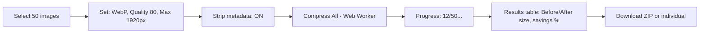

## Why Compress Images for the Web?

Images make up ~50% of average page weight. Unoptimized images slow page loads, hurt Core Web Vitals (LCP, CLS), increase bandwidth costs, and degrade user experience — especially on mobile.

An online image compressor reduces file sizes by 40-80% with minimal quality loss. DevStackIO's [Image Compressor](/tools/image-compressor) runs entirely in your browser using Web Workers — no uploads, no limits, supports JPEG, PNG, WebP, AVIF. Batch process hundreds of images locally.

## Image Formats Compared

| Format | Compression | Transparency | Animation | Browser Support | Best For |
|--------|-------------|--------------|-----------|-----------------|----------|
| **JPEG** | Lossy | ❌ | ❌ | Universal | Photos, complex images |
| **PNG** | Lossless | ✅ | ❌ | Universal | Screenshots, logos, text |
| **WebP** | Lossy + Lossless | ✅ | ✅ | 95%+ | **Modern default** |
| **AVIF** | Best lossy | ✅ | ✅ | 85%+ | Maximum compression |
| **SVG** | Vector (lossless) | ✅ | ✅ (SMIL) | Universal | Icons, illustrations |
| **JPEG XL** | Best overall | ✅ | ✅ | Emerging | Future-proof |

**Recommendation**: Use **WebP** for most cases. Use **AVIF** when browser support allows (progressive enhancement). Keep **PNG** for sharp edges/text. Use **SVG** for icons/logos.

## Compression Techniques

### Lossy (Discards Data)
- **Quantization** — Reduces color precision (JPEG quality 1-100)
- **Chroma subsampling** — 4:2:0 reduces color resolution (human eye less sensitive)
- **Transform coding** — DCT (JPEG), wavelet (JPEG 2000), AV1 (AVIF)

### Lossless (Preserves Exact Data)
- **Deflate/Huffman** — PNG, WebP lossless
- **LZ77 + entropy coding** — Brotli-style (WebP, AVIF)
- **Palette reduction** — 256 colors for simple images

### Perceptual (Best of Both)
- **Butteraugli/SSIMULACRA** — Optimize for human perception
- **JPEG XL, AVIF** — Advanced perceptual modeling

## Quality vs. Size Trade-offs

```
JPEG Quality vs File Size (typical photo, 2MP):
Quality 100: 2.4 MB  (visually lossless)
Quality 90:  850 KB  (excellent, recommended)
Quality 80:  520 KB  (very good)
Quality 70:  380 KB  (good, web standard)
Quality 60:  300 KB  (acceptable)
Quality 50:  240 KB  (visible artifacts)
Quality 30:  150 KB  (blocky, avoid)
Quality 10:  80 KB   (heavy artifacts)
```

**Rule of thumb**: JPEG 75-85, WebP 70-80, AVIF 50-65 for equivalent visual quality.

## How to Compress Images Online (Step by Step)

1. **Open the compressor** — [DevStackIO Image Compressor](/tools/image-compressor)
2. **Upload images** — Drag-and-drop or click to select (multiple files, up to 100MB each)
3. **Choose output format** — WebP (recommended), JPEG, PNG, AVIF, or keep original
4. **Set quality** — Slider 1-100 with live preview and file size estimate
5. **Resize (optional)** — Max width/height, maintain aspect ratio
6. **Strip metadata** — Remove EXIF, ICC profiles, XMP (saves 5-15%)
7. **Compress** — Click "Compress All" — Web Worker processes in background
8. **Download** — Individual files or ZIP archive

## Batch Processing Workflow



**Example results** (50 mixed photos, 2-8MB each):
| Metric | Before | After | Savings |
|--------|--------|-------|---------|
| Total size | 184 MB | 42 MB | **77%** |
| Avg per image | 3.7 MB | 840 KB | 77% |
| Max dimension | 4000×3000 | 1920×1440 | — |
| Format | JPEG/PNG | WebP | — |

## Format-Specific Optimization

### JPEG → WebP (Lossy)
```bash
# Command line (cwebp)
cwebp -q 80 input.jpg -o output.webp
# -q 80 = quality 80 (0-100)
# -m 6 = compression method (0-6, slower=smaller)
# -mt = multi-threaded
```

### PNG → WebP (Lossless)
```bash
cwebp -lossless input.png -o output.webp
# Or: pngquant for lossy PNG → smaller PNG
pngquant --quality=65-80 input.png
```

### AVIF (Maximum Compression)
```bash
# avifenc (libavif)
avifenc -q 50 -s 6 input.jpg output.avif
# -q 50 = quality (0-100, lower=smaller)
# -s 6 = speed (0=slowest/best, 10=fastest)
```

### SVG Optimization (SVGO)
```bash
# Remove metadata, minify paths, merge groups
npx svgo input.svg -o output.svg --config='{
  "plugins": [
    "removeDimensions",
    "removeXMLNS",
    "cleanupAttrs",
    "convertPathData"
  ]
}'
```

## Responsive Images (Serve Right Size)

### `<picture>` Element (Art Direction)
```html
<picture>
  <!-- AVIF for supporting browsers -->
  <source type="image/avif" srcset="hero.avif">
  <!-- WebP fallback -->
  <source type="image/webp" srcset="hero.webp">
  <!-- JPEG fallback -->
  
</picture>
```

### `srcset` + `sizes` (Resolution Switching)
```html

```

### CSS `image-set()` (Background Images)
```css
.hero {
  background-image: image-set(
    "hero.avif" type("image/avif"),
    "hero.webp" type("image/webp"),
    "hero.jpg"  type("image/jpeg")
  );
}
```

## Core Web Vitals Impact

| Metric | Unoptimized | Optimized | Improvement |
|--------|-------------|-----------|-------------|
| **LCP** (Largest Contentful Paint) | 4.2s | 1.8s | **57% faster** |
| **CLS** (Cumulative Layout Shift) | 0.25 | 0.02 | **92% less** |
| **TB** (Total Blocking Time) | 380ms | 45ms | **88% less** |
| **Page Weight** | 3.2 MB | 890 KB | **72% less** |
| **Bandwidth (1M visits/mo)** | 3.2 TB | 890 GB | **$2,300/mo saved** |

*Data: HTTP Archive, real-world case studies (Etsy, Pinterest, Walmart)*

## Automation: Build-Time Compression

### Vite / Rollup
```javascript
// vite.config.js
import imagemin from 'vite-plugin-imagemin';
export default {
  plugins: [
    imagemin({
      gzip: true,
      webp: { quality: 80 },
      avif: { quality: 50 },
      pngquant: { quality: [0.7, 0.8] },
      jpegtran: { progressive: true },
    })
  ]
};
```

### Webpack
```javascript
// webpack.config.js
const ImageMinimizerPlugin = require('image-minimizer-webpack-plugin');
module.exports = {
  optimization: {
    minimizer: [
      new ImageMinimizerPlugin({
        minimizer: {
          implementation: ImageMinimizerPlugin.imageminMinify,
          options: {
            plugins: [
              ['imagemin-webp', { quality: 80 }],
              ['imagemin-avif', { quality: 50 }],
              ['imagemin-pngquant', { quality: [0.7, 0.8] }],
              ['imagemin-jpegtran', { progressive: true }],
            ],
          },
        },
      }),
    ],
  },
};
```

### Next.js (Built-in)
```javascript
// next.config.js
module.exports = {
  images: {
    formats: ['image/avif', 'image/webp'],
    deviceSizes: [640, 750, 828, 1080, 1200, 1920, 2048, 3840],
    imageSizes: [16, 32, 48, 64, 96, 128, 256, 384],
  },
};
```

### GitHub Actions (CI)
```yaml
# .github/workflows/images.yml
name: Optimize Images
on: [push, pull_request]
jobs:
  optimize:
    runs-on: ubuntu-latest
    steps:
      - uses: actions/checkout@v4
      - name: Compress images
        uses: actions/upload-artifact@v4
        with:
          path: public/images/**/*
      - run: |
          npx @squoosh/cli --webp '{"quality":80}' --avif '{"cqLevel":35}' public/images/**/*
      - uses: actions/upload-artifact@v4
        with:
          name: optimized-images
          path: public/images/**/*
```

## Privacy & Performance

DevStackIO's Image Compressor runs in Web Workers. Your images never leave your browser. No uploads, no server processing, no logging. Handles 100MB+ files, batch processes 100+ images smoothly.

- **Zero server interaction** — WASM/Web Worker client-side
- **No persistence** — Images exist only in memory → download
- **Streaming** — Large files processed in chunks
- **Open source** — Audit on [GitHub](https://github.com/roddavinod99)

## FAQ

**What's the best quality setting for web?**
JPEG/WebP: 75-85. AVIF: 50-65. Start at 80, compare visually, adjust.

**Does compression remove EXIF data?**
Yes, by default. Toggle "Keep metadata" if you need copyright, GPS, or camera settings preserved.

**Can I compress animated images (GIF/WebP/AVIF)?**
Yes — WebP and AVIF support animation. GIF compression uses lossy palette reduction.

**What about SVG optimization?**
Use [SVG Optimizer](/tools/svg-optimizer) — removes metadata, minifies paths, merges groups.

**Is there a file size limit?**
Browser handles ~100MB per file. For larger batches, use CLI tools.

**Does it work offline?**
Yes, after first load. Service Worker caches WASM modules.

**Can I convert HEIC/HEIF from iPhone?**
Not directly in browser. Convert to JPEG first: `heif-convert` CLI or online converter.

**What's the difference between WebP and AVIF?**
AVIF (AV1-based) compresses 20-30% better than WebP at same quality. WebP has wider browser support (95% vs 85%). Use both with `<picture>` fallback.

## Related Tools

- [Image Resizer](/tools/image-resizer) — Resize dimensions, batch process
- [SVG Optimizer](/tools/svg-optimizer) — Minify SVG with SVGO
- [Favicon Generator](/tools/favicon-generator) — Multi-platform favicons
- [Placeholder Image Generator](/tools/placeholder-image) — Dev/design placeholders
- [EXIF Reader](/tools/exif-reader) — View metadata before stripping
- [Color Eyedropper](/tools/color-eyedropper) — Pick colors from images

## References

- [WebP Documentation](https://developers.google.com/speed/webp)
- [AVIF Specification](https://aomediacodec.github.io/av1-avif/)
- [JPEG XL Overview](https://jpeg.org/jpegxl/)
- [SVGO — SVG Optimizer](https://github.com/svg/svgo)
- [Image Compression for Web (web.dev)](https://web.dev/learn/images/)
- [Core Web Vitals](https://web.dev/vitals/)
- [HTTP Archive: Image Stats](https://httparchive.org/reports/state-of-images)
- [Responsive Images (MDN)](https://developer.mozilla.org/en-US/docs/Learn/HTML/Multimedia_and_embedding/Responsive_images)
- [Squoosh CLI](https://github.com/GoogleChromeLabs/squoosh/tree/main/cli)

---

*Compress images now → [Free Image Compressor](/tools/image-compressor) — JPEG, PNG, WebP, AVIF. Batch, resize, strip metadata. 100% client-side, no limits.*